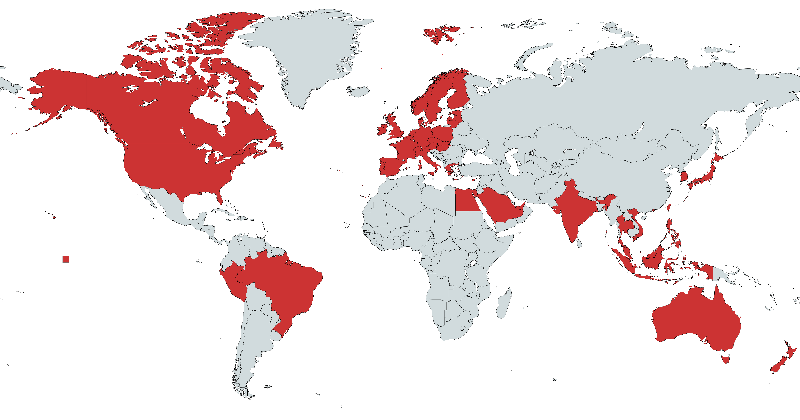

# Postcode Extractor

This crate extracts postcodes from addresses. 

Parse a postcode from an address of a known country

```
let address = "15 Main Road, London, SW21 3LD;
let postcode = evaluate_single_country(address, Country::GB, true).unwrap().unwrap();

assert_equal!(postcode.base, "SW21 3LD");
```

Parse a postcode from a known country

```
let address = "SW21 3LD;
let postcode = evaluate_single_country(address, Country::GB, false).unwrap().unwrap();

assert_equal!(postcode.base, "SW21 3LD");
```

Parse a postcode from an address of an unknown country

```
let address = "15 Main Road, London, SW21 3LD;
let postcode = evaluate_all_countries(address, true).unwrap().unwrap();

assert_equal!(postcode.postcode.base, "SW21 3LD");
assert_equal!(postcode.country, Country::GB);
```

Parse a postcode from an unknown country

```
let address = "SW21 3LD;
let postcode = evaluate_all_countries(address, false).unwrap().unwrap();

assert_equal!(postcode.postcode.base, "SW21 3LD");
assert_equal!(postcode.country, Country::GB);
```

## Coverage

